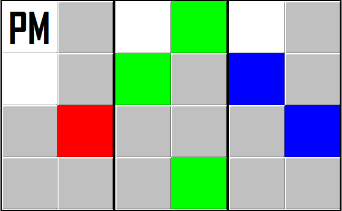

# BinaryClock

Created in 2014, this project was my first personal project that I successfully finished. The goal was to simply recreate the behavior of a binary clock in the form of a small desktop widget.

It will run indefinitely as a clock would and requires no interaction from the user after launching.

*Animated GIF will continuously loop; does not reflect current time.*

---

## Run Instructions
1. Java8 may need to be installed on your machine
1. Launch the `/dist/BinaryClock.jar` executable

---

## Specifications

* **Java** for clock logic
* **Java Swing** for graphical user interface
